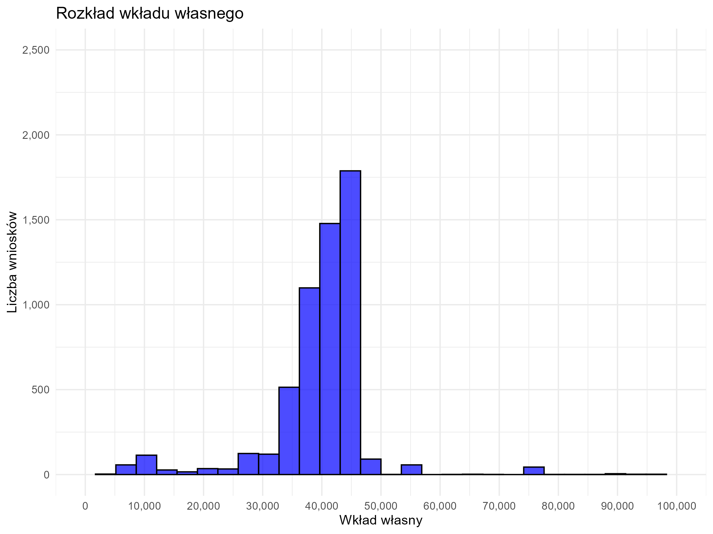
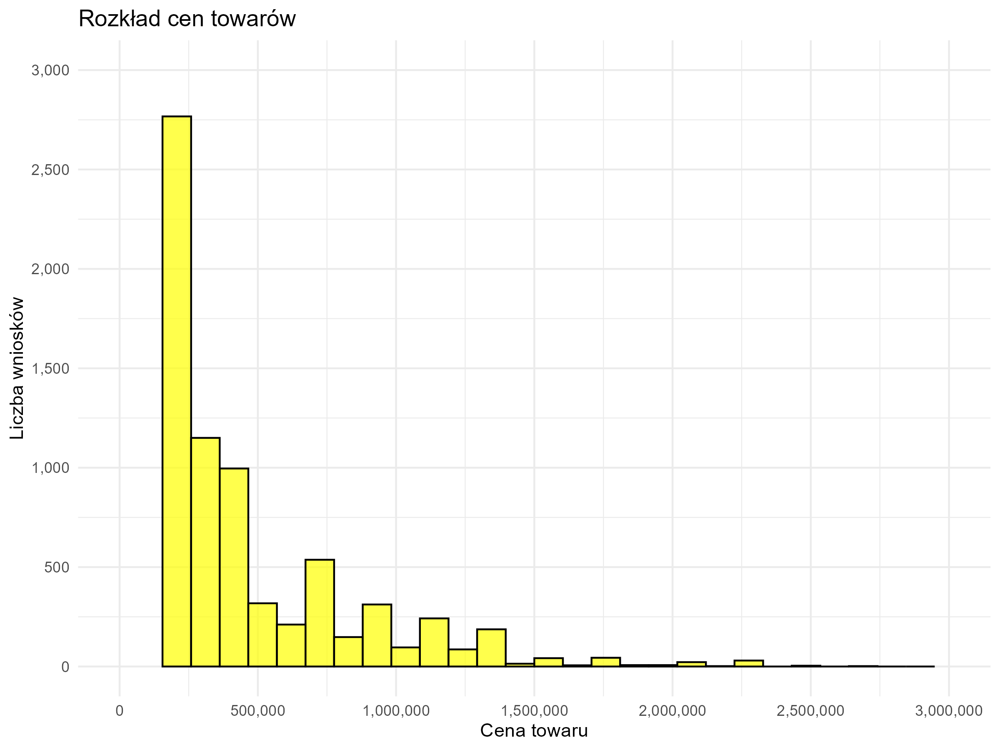
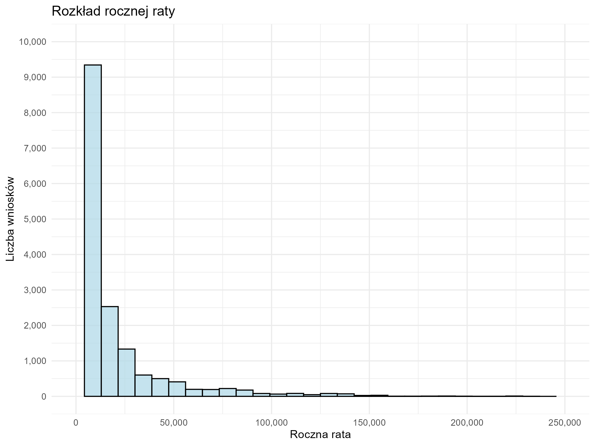
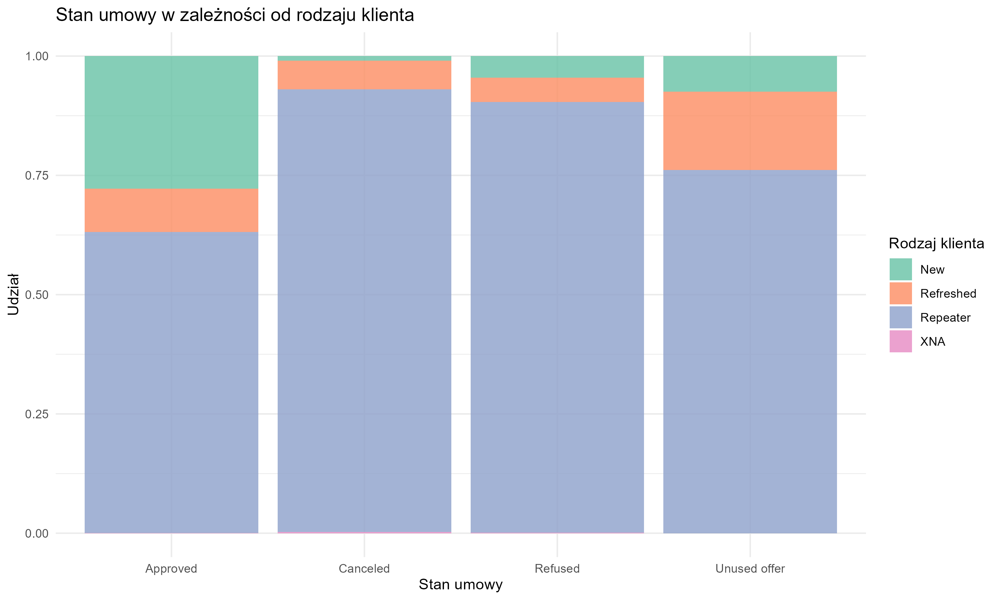
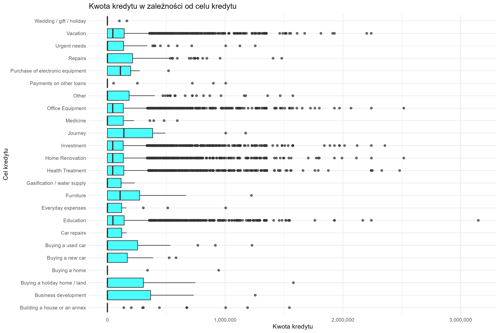
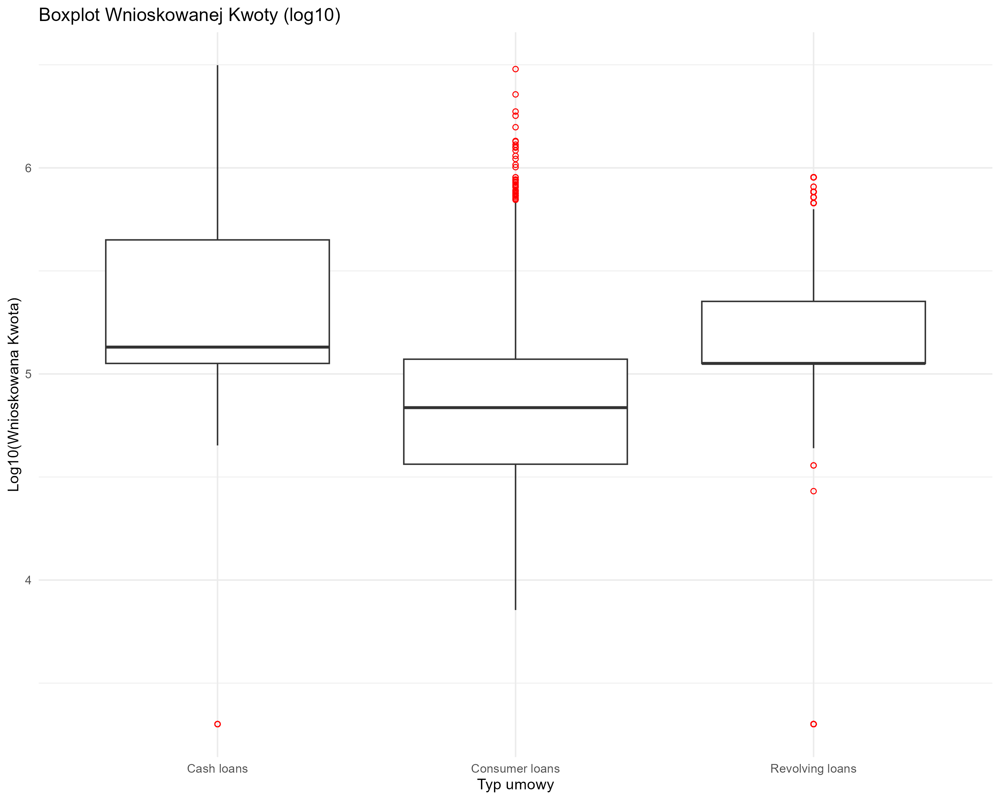
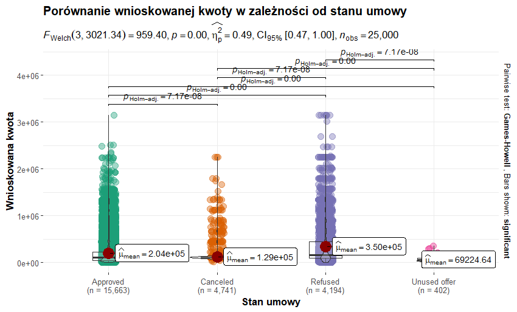
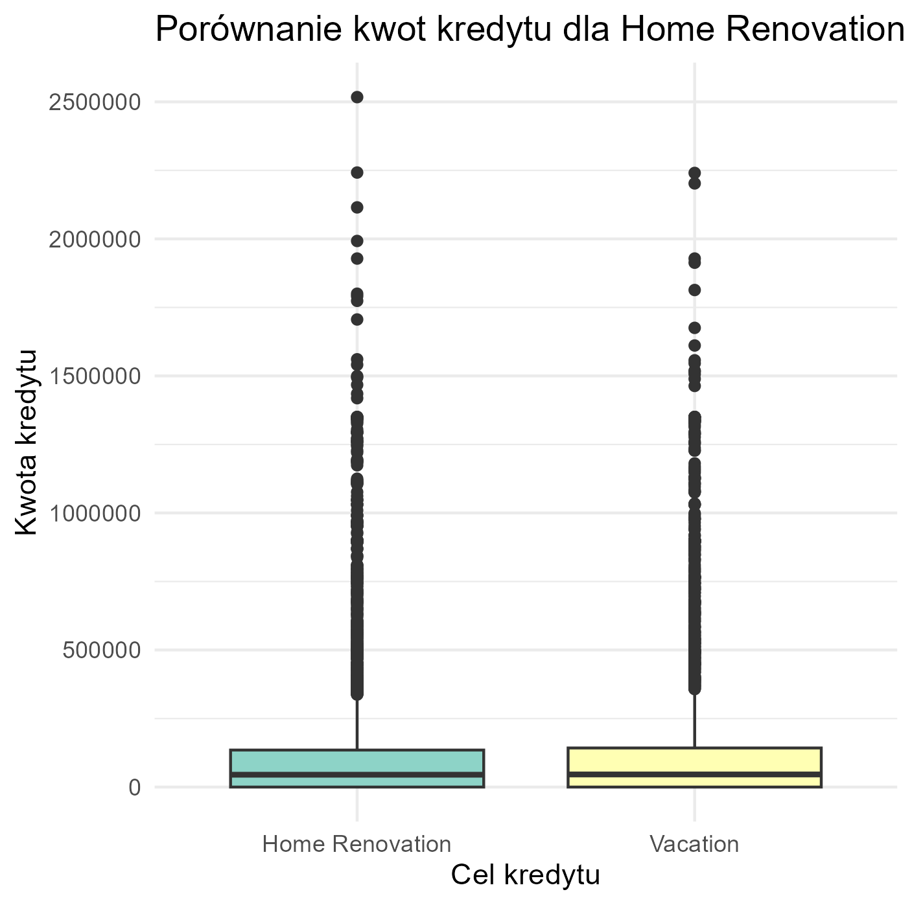
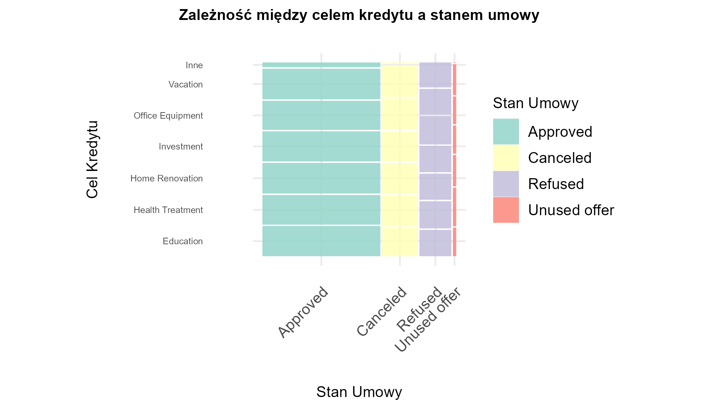

# Raport Analizy Danych - Projekt Zespołowy 2024-2025 {.title}

#### Autorzy: {.author}

-   Yuliya Sharkova
-   Michał Owczarek
-   Aleksander Urbański

🎯 Raport Analizy Danych - Projekt Zespołowy 2024-2025 ⭐ 1. Wprowadzenie

Analiza danych odgrywa fundamentalną rolę w realizacji projektów opartych na danych.

Niniejszy raport koncentruje się na obróbce historycznych danych dotyczących wniosków kredytowych. Proces ten obejmuje ich: - oczyszczanie, - analizę, - wizualizację.

Dzięki odpowiedniemu przetwarzaniu danych możliwe jest nie tylko eliminowanie nieścisłości, ale również ich przekształcenie, co pozwala na: - formułowanie wartościowych wniosków, - podejmowanie bardziej świadomych decyzji strategicznych.

Celem projektu jest: 1. Przedstawienie kompleksowego podejścia do analizy danych. 2. Zaprezentowanie etapów od przygotowania danych aż po ich interpretację.

Szczególny nacisk położono na: - identyfikację braków, - weryfikację spójności, - transformację kluczowych informacji.

Te etapy stanowią fundament dla zaawansowanych metod analitycznych, takich jak: - wnioskowanie statystyczne, - odkrywanie ukrytych wzorców w danych.

Ten dokument zawiera podsumowanie procesu analizy i oczyszczania danych w projekcie zespołowym. Plik wejściowy: `previous_application_new.csv`\
⭐ 2. Data Cleansing. Wrangling

### 2.1. Analiza braków

-   Zidentyfikowano brakujące dane w kilku kolumnach, uwzględniając ich liczbę i procent.
-   Skupiono się na kolumnach z największą liczbą braków.

### 2.2. Usuwanie kolumn z dużą liczbą braków

-   Usunięto kolumny z brakami danych przekraczającymi 90%.
-   Lista usuniętych kolumn została zarchiwizowana.

### 2.3. Naprawa braków w danych

-   Braki w danych liczbowych uzupełniono medianą.
-   Braki w danych kategorycznych uzupełniono trybem.

### 2.4. Walidacja danych

-   Wszystkie kolumny zostały zweryfikowane jako kompletne.
-   Walidacja potwierdziła brak brakujących danych.

### 2.5. Zapis oczyszczonych danych

> Proces przetwarzania i czyszczenia danych był kluczowym krokiem w przygotowaniu informacji do dalszej analizy.

-   **Eliminacja kolumn:** Usunięto kolumny z dużą liczbą braków, co pozwoliło na poprawę spójności danych.
-   **Uzupełnienie braków:** Braki w zmiennych liczbowych uzupełniono medianą, natomiast w zmiennych kategorycznych trybem.

> Dzięki tym operacjom uzyskano zestaw danych: - kompletny, - zgodny ze standardami analitycznymi, - gotowy do dalszego przetwarzania.

> **Weryfikacja danych:** - Walidacja pozwoliła zidentyfikować i wyeliminować potencjalne rozbieżności. - Potwierdzono integralność i spójność przekształconych danych.

> Oczyszczone dane stanowią solidną podstawę dla kolejnych etapów projektu, takich jak: - wizualizacja danych, - analiza opisowa, - testy statystyczne.

> Finalny plik z przetworzonymi danymi został zapisany pod ścieżką: `C:/Users/user/Documents/GIT projekts/Analiza_danych-Projekt_Zespolowy2024-2025/previous_application_cleaned_finished.csv`

⭐ 3. Wizualizacja Danych

W tej sekcji przedstawiono kluczowe wizualizacje danych przygotowanych na podstawie wcześniejszej analizy. Każdy wykres został zapisany i opisany poniżej.

### Rozkład Wnioskowanej Kwoty

 - Większość wniosków dotyczy niewielkich kwot poniżej 500 000. - Rozkład jest prawostronnie skośny.

### Rozkład Kwoty Kredytu

 - Zdecydowana większość wniosków dotyczy niskich kwot kredytu (poniżej 500 000). - Pojawiają się nieliczne przypadki wysokich kwot kredytu (powyżej 2 000 000).

### Rozkład Wkładu Własnego

 - Największa liczba wniosków dotyczy wkładu własnego w przedziale 40 000–50 000. - Rozkład jest symetryczny z niewielką liczbą wartości skrajnych.

### Rozkład Cen Towarów

 - Dominują towary o cenie poniżej 500 000. - Rozkład wskazuje na prawostronną skośność.

### Rozkład Rocznej Raty

 - Większość wniosków dotyczy rat rocznych poniżej 50 000. - Nieliczne przypadki wskazują na wysokie raty powyżej 150 000.

### Rozkład Wnioskowanej Kwoty w Podziale na Typ Umowy

 - Kredyty gotówkowe najczęściej mieszczą się w przedziale 100 000–150 000. - Inne typy kredytów skupiają się w niższych przedziałach kwotowych.

### Rozkład Cen Towarów w Podziale na Kategorie Portfela

 - Towary o niskich cenach (poniżej 500 000) dominują niezależnie od kategorii portfela.

### Zależność Między Wnioskowaną Kwotą a Kwotą Kredytu

 - Widoczna jest liniowa zależność między wnioskowaną kwotą a przyznanym kredytem.

### Zależność Między Procentem Kredytu a Wkładem Własnym

 - Wysoki wkład własny częściej występuje przy niższym procencie kredytu.

### Rozkład Celów Kredytów

 - Dominują kredyty przeznaczone na remonty, inwestycje i bieżące wydatki.

### Stan Umowy w Zależności od Rodzaju Klienta

 - Proporcje stanów umowy różnią się w zależności od rodzaju klienta.

### Rozkład Liczby Wniosków w Czasie

 - Najwięcej wniosków jest składanych w godzinach popołudniowych.

### Liczba Wniosków w Czasie (Dzień Decyzji)

 - Liczba wniosków zmienia się w zależności od dnia, wskazując na różnorodne trendy.

### Kwota Kredytu w Zależności od Celu Kredytu

 - Kredyty na budowę domu lub zakup nieruchomości charakteryzują się najwyższymi kwotami.

### Rozkład Liczby Rat w Podziale na Kategorię Produktu

 - Liczba rat różni się w zależności od kategorii produktu. Najwięcej rat przypada na produkty hipoteczne.

Każda wizualizacja została zapisana w formacie `.png` i może być wykorzystywana do dalszej analizy i prezentacji wyników.

⭐ 4. Analiza Opisowa

W tej sekcji przedstawiono analizę danych w oparciu o różne zmienne opisowe i ilościowe.

### 4.1 Boxplot: Wnioskowana Kwota (log10)

Poniżej przedstawiono boxplot dla wnioskowanej kwoty z wykorzystaniem skali logarytmicznej.

 - Wykres przedstawia rozkład wnioskowanej kwoty w skali logarytmicznej. - Widoczna jest obecność wartości odstających w górnym zakresie kwot.

### 4.2 Macierz Korelacji

Wykres przedstawia macierz korelacji pomiędzy zmiennymi numerycznymi w zbiorze danych.

 - Wykres pokazuje relacje między zmiennymi numerycznymi w danych. - Silne korelacje mogą sugerować redundancję zmiennych lub istotne relacje.

### 4.3 Obserwacje na Podstawie Analizy Opisowej

-   **Macierz Korelacji**: Wskazuje na potencjalne powiązania między zmiennymi, które mogą być istotne dla dalszych analiz.
-   **Boxplot Wnioskowanej Kwoty**: Rozkład wskazuje na obecność wartości odstających w górnym zakresie, co może mieć wpływ na analizy statystyczne.

### 4.4 Wnioski i Sugestie

-   Większość wniosków dotyczy umiarkowanych kwot, ale widoczne są wartości odstające w górnym zakresie.
-   Silne korelacje między zmiennymi numerycznymi mogą sugerować redundancję lub istotne relacje, które należy uwzględnić w dalszych analizach.

⭐ 5. Wnioskowanie (testy statystyczne)

### 5.1. Porównanie wnioskowanej kwoty w zależności od stanu umowy

 Na podstawie wykresu i wyników testów statystycznych z użyciem funkcji ggbetweenstats, można wyciągnąć następujące wnioski: 1. *Istotność różnic między grupami*:

Wartość statystyki F dla testu Welch ANOVA wynosi *F(3, 3021.34) = 959.40*, a wartość p jest równa *p \< 0.001*. Oznacza to, że istnieją istotne statystycznie różnice w średnich „wnioskowanej kwoty” między grupami określonymi przez „stan_umowy” (Approved, Refused, Canceled, Unused offer).

2.  *Wielkość efektu*:\
    Wielkość efektu (eta squared) wynosi *0.49*, co wskazuje na bardzo duży efekt w kontekście różnic między grupami. Oznacza to, że znaczna część zmienności w wartościach „wnioskowanej kwoty” jest wyjaśniana przez zmienną „stan_umowy”.

3.  *Porównania parami (Post-hoc)*:\
    Testy post-hoc (Games-Howell) pokazują istotne różnice między wszystkimi grupami:

    -   Approved vs Refused: *p \< 0.001*
    -   Approved vs Canceled: *p \< 0.001*
    -   Approved vs Unused offer: *p \< 0.001*
    -   Refused vs Canceled: *p \< 0.001*
    -   Refused vs Unused offer: *p \< 0.001*
    -   Canceled vs Unused offer: *p \< 0.001*\
        Wyniki te wskazują, że różnice między średnimi wartościami w każdej parze grup są statystycznie istotne.

4.  *Średnie wartości (średnie wnioskowane kwoty)*:

    -   *Approved*: średnia wnioskowana kwota wynosi około *204 tys.*.
    -   *Refused*: średnia wnioskowana kwota wynosi około *350 tys.*.
    -   *Canceled*: średnia wnioskowana kwota wynosi około *129 tys.*.
    -   *Unused offer*: średnia wnioskowana kwota wynosi około *69 tys.*.

5.  *Wizualizacja*:

    -   Grupa Approved charakteryzuje się największą liczbą obserwacji, ale niższymi średnimi w porównaniu do Refused.
    -   W grupie Refused widoczne są wyższe wartości wnioskowanych kwot, co może wskazywać na częstsze odrzucanie wyższych wniosków.
    -   Grupa Unused offer ma najniższe średnie wartości, co może sugerować, że te oferty były na ogół niskiej wartości i nie zostały wykorzystane.

### Wnioski:

-   Istnieją wyraźne różnice w wysokości „wnioskowanej kwoty” w zależności od statusu umowy.
-   Najwyższe wnioskowane kwoty odnotowano w grupie „Refused”, co może świadczyć o bardziej rygorystycznym podejściu do wyższych wniosków.
-   Najniższe wartości wniosków znajdują się w grupie „Unused offer”, co może wskazywać na ich mniejsze znaczenie w kontekście całego zbioru danych.

### 5.2. Korelacja między wnioskowaną kwotą a kwotą kredytu

 Na powyższym wykresie przedstawiono analizę korelacji między wnioskowaną kwotą kredytu a faktycznie przyznaną kwotą kredytu.

1.  **Wartość współczynnika korelacji r (Pearsona):**
    -   Współczynnik korelacji wynosi **r = 0.65**. Jest to umiarkowanie silna dodatnia korelacja, co oznacza, że wraz ze wzrostem wnioskowanej kwoty, zazwyczaj rośnie również kwota przyznanego kredytu. Nie jest to jednak zależność doskonała (r = 1 oznaczałoby idealną liniowość).
2.  **Istotność statystyczna:**
    -   Wartość p = 0.00 (z dokładnością do obliczeń komputerowych) wskazuje na to, że korelacja jest **statystycznie istotna**. Innymi słowy, istnieje bardzo małe prawdopodobieństwo, że zaobserwowana zależność jest dziełem przypadku.
3.  **Przedział ufności:**
    -   Przedział ufności na poziomie 95% wynosi [0.65, 0.66]. To oznacza, że rzeczywisty współczynnik korelacji w populacji znajduje się w tym zakresie z 95% pewnością.
4.  **Liczność próby:**
    -   W analizie uwzględniono 25 000 par danych (**n_pairs = 25,000**), co jest bardzo dużą próbką. Duża liczba danych zwiększa wiarygodność wyników i minimalizuje wpływ losowych błędów.
5.  **Wykres rozrzutu:**
    -   Na wykresie widać punkty danych (czarne kropki), które są rozproszone wokół niebieskiej linii regresji (pokazującej trend liniowy). Większość punktów układa się zgodnie z tą linią, co potwierdza dodatnią korelację.
    -   Histogramy na osiach pokazują rozkład zmiennych: dla wnioskowanej kwoty (oś pozioma) oraz kwoty kredytu (oś pionowa). Obie zmienne mają rozkłady z dużą liczbą małych wartości i niewielką liczbą dużych wartości (asymetria w prawo).
6.  **t-Studenta:**
    -   Wartość t-Studenta wynosi 136.78, co świadczy o bardzo dużym efekcie przy tak dużej próbie.

### Wnioski:

-   Istnieje istotna i umiarkowanie silna dodatnia korelacja między wnioskowaną a przyznaną kwotą kredytu.
-   Analiza sugeruje, że choć kwota kredytu jest generalnie zbliżona do kwoty wnioskowanej, istnieją również pewne odchylenia (prawdopodobnie z powodu polityk kredytowych lub zdolności kredytowej wnioskodawców).

## 5.3 Analiza zależności między stanem umowy a celem kredytu

Na przedstawionym wykresie widzimy wyniki analizy zależności między zmiennymi **„stan_umowy”** a **„cel_kredytu”**, przeprowadzonej przy pomocy testu chi-kwadrat oraz wizualizacji procentowego udziału kategorii w ramach celu kredytu.

------------------------------------------------------------------------

### **1. Wyniki statystyczne**

-   **Test chi-kwadrat:**
    -   Wartość testu $\chi^2$ wynosi **1384.86**, co oznacza, że istnieje zależność między zmiennymi.
    -   Wartość p **(p \< 0.001)** wskazuje, że zależność jest **statystycznie istotna**.
-   **Cramer V = 0.13**:
    -   Wskaźnik Cramera V (od 0 do 1) sugeruje **słabą zależność** między kategoriami.

------------------------------------------------------------------------

### **2. Kluczowe obserwacje**

Wykres słupkowy prezentuje udział różnych stanów umowy (`Approved`, `Refused`, `Canceled`, `Unused offer`) w ramach każdego celu kredytu (`cel_kredytu`). Kluczowe obserwacje:

-   **Kategorie dominujące:**
    -   **Approved (Różowy):** Dominuje w większości kategorii celu kredytu, takich jak *"Office Equipment" (55%)*, *"Health Treatment" (63%)*, *"Education" (65%)*, czy *"Buying a used car" (62%)*.
    -   **Refused (Pomarańczowy):** Jest wyraźnie widoczny w niektórych celach, np. *"Building a house or annex" (73%)* i *"Buying a home" (73%)*.
    -   **Canceled (Fioletowy):** Stanowi relatywnie niewielki procent (zwykle między 10% a 20%), ale wyróżnia się w takich celach jak *"Business development" (14%)*.
    -   **Unused offer (Zielony):** Występuje sporadycznie i ma niewielki udział.
-   **Najbardziej specyficzne kategorie:**
    -   *"Gasification/water supply":* W tej kategorii dominują umowy w stanie **„Unused offer” (33%)**, co odróżnia ją od innych celów kredytowych.
    -   *"Wedding/gift/holiday":* **Approved (80%)** wyraźnie dominuje.
    -   *"Building a house or annex":* Aż **73%** umów jest **Refused**, co może wskazywać na specyficzne trudności związane z tym celem.

------------------------------------------------------------------------

### **3. Wnioski**

-   Ogólnie, większość wniosków kredytowych kończy się statusem **Approved**, szczególnie w kategoriach o niższym ryzyku, takich jak edukacja, sprzęt biurowy, czy zdrowie.
-   Wysoki odsetek **Refused** pojawia się w kategoriach związanych z większym ryzykiem kredytowym lub większymi kosztami, takich jak budowa domu czy zakup nieruchomości.
-   Niski udział kategorii **Canceled** i **Unused offer** sugeruje, że są to rzadsze przypadki, ale ich specyfika zależy od celu kredytu.

## 5.4 Porównanie procentu wkłądu własnego w zależności od stanu umowy

### Interpretacja wyników

Wykres przedstawia analizę różnic w procentowym wkładzie własnym („procent_wkladu_wlasny”) w zależności od stanu umowy („stan_umowy”) za pomocą testu Kruskala-Wallisa. Oto główne wnioski:

------------------------------------------------------------------------

#### **1. Wynik testu Kruskala-Wallisa**

-   Statystyka testu: $\chi^2 = 7899.78$
-   Wartość p: $p < 0.001$\
    Test wykazał istotne statystycznie różnice pomiędzy grupami „stan_umowy”. Oznacza to, że grupy różnią się od siebie pod względem mediany procentu wkładu własnego.

------------------------------------------------------------------------

#### **2. Podsumowanie wyników dla grup**

-   **Approved (zatwierdzone)**:
    -   Liczność: $n = 15,663$
    -   Mediana wkładu własnego: **0.19%**
-   **Canceled (anulowane)**:
    -   Liczność: $n = 4,741$
    -   Mediana wkładu własnego: **22.50%**
-   **Refused (odrzucone)**:
    -   Liczność: $n = 4,194$
    -   Mediana wkładu własnego: **0.12%**
-   **Unused offer (nieużyte)**:
    -   Liczność: $n = 402$
    -   Mediana wkładu własnego: **0.00%**

Grupa „Canceled” znacząco różni się od pozostałych pod względem mediany procentu wkładu własnego, wskazujac na znacznie wyższe wartości wkładu własnego w tej grupie.

------------------------------------------------------------------------

#### **3. Testy post hoc**

-   Testy post hoc (Dunn test) wskazują na istotne różnice pomiędzy wszystkimi parami grup, co jest widoczne na wykresie (linie i wartości $p_{Holm-adj}$).
-   Największe różnice występują pomiędzy:
    -   „Canceled” a „Approved”
    -   „Canceled” a „Refused”
    -   „Canceled” a „Unused offer”

------------------------------------------------------------------------

#### **4. Interpretacja praktyczna**

-   Wysoka mediana wkładu własnego w grupie „Canceled” sugeruje, że umowy z wyższym wkładem własnym były częściej anulowane. Może to wynikać z trudności w spełnieniu warunków lub innych barier związanych z tym typem umów.
-   Grupy „Approved”, „Refused”, i „Unused offer” charakteryzują się niskimi medianami wkładu własnego, co może sugerować, że niższy wkład własny jest bardziej typowy w przypadku decyzji pozytywnych i odrzuconych.

## 5.5 Analiza różnicy w stosunku kwoty kredytu w zależności od typu umowy

Wykres przedstawia wyniki analizy różnic w „stosunku kwoty kredytu” w zależności od „typu umowy” za pomocą testu Kruskala-Wallisa. Oto kluczowe wnioski:

------------------------------------------------------------------------

#### **1. Wynik testu Kruskala-Wallisa**

-   Statystyka testu: $\chi^2 = 1339.78$
-   Wartość p: $p < 0.001$\
    Wynik wskazuje, że istnieją istotne statystycznie różnice w „stosunku kwoty kredytu” pomiędzy typami umów.

------------------------------------------------------------------------

#### **2. Mediany „stosunku kwoty kredytu” w grupach**

-   **Cash loans (kredyty gotówkowe):**
    -   Liczność: $n = 11,050$\
    -   Mediana: **0.00**
    -   Kredyty gotówkowe mają najniższy stosunek kwoty kredytu, co sugeruje, że są one stosunkowo mniejsze w odniesieniu do innych grup.
-   **Consumer loans (kredyty konsumenckie):**
    -   Liczność: $n = 11,060$\
    -   Mediana: **6.00**\
    -   Najwyższa mediana, co sugeruje, że te umowy charakteryzują się wyższym stosunkiem kwoty kredytu.
-   **Revolving loans (kredyty odnawialne):**
    -   Liczność: $n = 2,886$\
    -   Mediana: **5.00**\
    -   Mediana jest wyraźnie wyższa niż dla kredytów gotówkowych, ale niższa niż dla kredytów konsumenckich.

------------------------------------------------------------------------

#### **3. Testy post hoc (Dunn Test)**

-   Testy porównujące każdą parę grup wskazują istotne różnice między:
    -   „Cash loans” a „Consumer loans” ($p_{Holm-adj} < 0.001$)
    -   „Cash loans” a „Revolving loans” ($p_{Holm-adj} < 0.001$)
    -   „Consumer loans” a „Revolving loans” ($p_{Holm-adj} = 0.000283$)\
        Oznacza to, że każda grupa różni się istotnie od pozostałych pod względem mediany „stosunku kwoty kredytu”.

------------------------------------------------------------------------

#### **4. Wizualne różnice**

-   Kredyty gotówkowe („Cash loans”) są wyraźnie skoncentrowane na wartościach bliskich **0**, co sugeruje, że stosunkowo niewielki procent ich wartości odnosi się do pełnej kwoty kredytu.
-   Kredyty konsumenckie („Consumer loans”) mają znacznie szerszy rozkład i najwyższe mediany, co oznacza, że są używane do finansowania większych transakcji w porównaniu do innych typów.
-   Kredyty odnawialne („Revolving loans”) plasują się pomiędzy obiema grupami, ale ich stosunek kwoty kredytu jest bliższy kredytom konsumenckim niż gotówkowym.

------------------------------------------------------------------------

#### **5. Praktyczna interpretacja**

-   **Dla banku:** Kredyty konsumenckie mają wyższy stosunek kwoty kredytu, co może wskazywać na większe ryzyko lub bardziej elastyczne podejście w tej kategorii. Kredyty gotówkowe, z kolei, są bardziej restrykcyjne i wydają się mniejsze w relacji do całej wartości kredytu.
-   **Dla klienta:** Osoby korzystające z kredytów gotówkowych mogą preferować mniejsze pożyczki, podczas gdy kredyty konsumenckie są używane do większych inwestycji (np. zakup sprzętu AGD czy samochodów).

## 5.6 Test t-studenta dla średnich kwot kredytu dla 2 celów: Home renovation i Vacation

H0: Średnia kwota kredytu jest taka sama w obydwu grupach.

HA: Średnia kwota kredytu różni się między grupami.

-   Brak podstaw do odrzucenia hipotezy zerowej, co oznacza, że nie ma statystycznie istotnych różnic między średnimi kwotami kredytu w grupach "Home renovation" i "Vacation".

-   Wskazuje na to wysoka wartość p (0,347) oraz niska wartość statystyki t (-0,941).

-   Po sprawdzeniu średnich dla obydwu badanych zmiennych,należy zauważyć ich zbliżony poziom (odpowiednio 126444,4 i 131327,5), co byłoby zgodne z wynikiem przeprowadzonego testu statystycznego.

Test Shapiro-Wilka:

-   Wyniki testu Shapiro-Wilka wskazują na to, że dane w obu grupach nie mają rozkładu normalnego.

-   Ponieważ dane nie są normalnie rozkładowe, test t-Studenta (który zakłada normalność danych) może nie być właściwy.

Test Manna-Whitneya:

-   Brak podstaw do odrzucenia hipotezy zerowej (H₀).

-   Oznacza to, że nie ma statystycznie istotnych różnic w medianach kwoty kredytu między grupami "Home Renovation" i "Vacation".

-   Wartość p (0,6004) jest znacznie większa od progu istotności.

## 5.7 Regresja liniowa dla liczby rat oraz kwoty kredytu

H0: Liczba rat i kwota kredytu nie są ze sobą skorelowane

HA: Liczba rat i kwota kredytu są ze sobą skorelowane

Równanie modelu regresji: kwota_kredytu = -25826,45 + 2545,53 \* liczba_rat

-   Gdy liczba rat wynosi 0, przewidywana kwota kredytu wynosi -25826,45.

-   Przy każdej dodatkowej racie, przewidywana kwota kredytu zwiększa się średnio o 2545,53 jednostek.

-   Wartość p dla liczby rat jest znacznie mniejsza niż 0,05, co oznacza, że liczba rat jest statystycznie istotną determinantą kwoty kredytu.

## 5.8 Test chi-kwadrat dla rodzaju płatności oraz stanu umowy

H0: Rodzaj płatności i stan umowy są od siebie niezależne

HA: Rodzaj płatności i stan umowy są od siebie zależne

-   Wartość p (\<2,2e-16), czyli znacznie mniejsza niż 0,05.

-   Należy odrzucić hipotezę zerową, co oznacza, że istnieje statystycznie istotna zależność między rodzajem płatności a stanem umowy.

-   Cash through the bank ma bardzo wysokie wartości w kolumnie "Approved" (9702.29 oczekiwane), co sugeruje, że znaczna część zaakceptowanych umów jest związana z tą formą płatności.

## 5.9 Test chi-kwadrat dla cel kredytu i stanu umowy

H0: Cel kredytu i stan umowy są od siebie niezależne

HA: Cel kredytu i stan umowy są od siebie zależne

-   Wartość p (\<2,2e-16), czyli znacznie mniejsza niż 0,05.

-   Należy odrzucić hipotezę zerową, co oznacza, że istnieje statystycznie istotna zależność między celem kredytu a stanem umowy.

-   Education i Vacation mają wysokie wartości oczekiwane i duży wpływ na wynik testu.

## 5.10 Test ANOVA w celu sprawdzenia czy średnia kwota kredytu różni się istonie między innymi celami kredytu

H0: Średnia kwota kredytu jest taka sama dla wsyzstkich celów kredytu

HA: Średnia kwota kredytu nie jest taka sama dla wszystkich celów kredytu

-   Wartość p (0,252) jest większe niż poziom istnotności 0,05.

-   Brak podstaw do odrzucenia hipotezy zerowej, co oznacza, że średnia kwota kredytu nie różni się.

-   istotnie między poszczególnymi celami kredytu.

⭐ 6. Podsumowanie i wnioski końcowe

### 6.1.1 Rozkład i zależności zmiennych

-   Większość wniosków kredytowych dotyczy małych i średnich kwot, poniżej 500 000 PLN.
-   Rozkłady takich zmiennych jak „wnioskowana kwota”, „wkład własny” czy „cena towaru” są prawostronnie skośne, co wskazuje na niewielką liczbę wysokich wartości.
-   Silna dodatnia korelacja (r = 0.65) między „wnioskowaną kwotą” a „kwotą kredytu” sugeruje liniową zależność, choć nie idealną.

### 6.1.2 Zależności między zmiennymi kategorycznymi

-   Zależność między „stanem umowy” a „celem kredytu” jest statystycznie istotna (p \< 0.001), ale słaba (Cramer V = 0.13).
-   Większość kredytów jest zatwierdzana dla celów takich jak edukacja, remonty czy sprzęt biurowy, natomiast odrzucone wnioski dominują przy większych celach, takich jak budowa domu.

### 6.1.3 Analiza procentu wkładu własnego

-   Wkład własny jest najwyższy dla umów anulowanych („Canceled”), co może wynikać z trudności w spełnieniu wymagań. Z kolei zatwierdzone umowy („Approved”) charakteryzują się bardzo niskimi medianami wkładu własnego.

### 6.1.4 Różnice w stosunku kwoty kredytu w zależności od typu umowy

-   Kredyty gotówkowe („Cash loans”) mają najniższy stosunek kwoty kredytu (mediana = 0.00), co sugeruje mniejsze znaczenie tej grupy.
-   Kredyty konsumenckie („Consumer loans”) mają najwyższy stosunek kwoty kredytu (mediana = 6.00), co wskazuje na ich większe użycie przy dużych transakcjach.

## 6.2.1 Wnioski końcowe

### 6.2.2 Profil kredytów

-   Kredyty gotówkowe dominują w przypadku mniejszych wniosków, natomiast kredyty konsumenckie są częściej używane do większych inwestycji. Kredyty odnawialne plasują się pomiędzy tymi kategoriami.

### 6.2.2 Polityka banku

-   Wyższy wkład własny w grupie „Canceled” może wskazywać na potrzebę przeglądu polityki dotyczącej anulowania wniosków o wysokie kwoty. Bank może rozważyć bardziej elastyczne podejście w tej kategorii.
-   Wysoki odsetek odrzuconych wniosków dla dużych projektów (np. budowa domu) sugeruje, że te cele mogą wymagać bardziej rygorystycznych warunków finansowych.

### 6.2.3 Potencjalne działania

-   Bank powinien skupić się na analizie przyczyn odrzucania kredytów na cele związane z budową i zakupem nieruchomości, gdyż te wnioski są kluczowe, ale często odrzucane.
-   Warto rozważyć zmniejszenie barier dla kredytów gotówkowych, które są preferowane przy mniejszych kwotach, aby zwiększyć ich dostępność i liczbę klientów.

### 6.2.4 Rekomendacje dla dalszych badań

-   Analiza szczegółowych przyczyn odrzucania wniosków.
-   Ocena efektywności polityki banku w kontekście kategorii klienta i celu kredytu.
