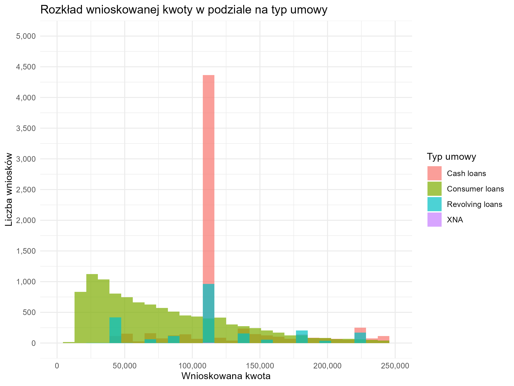
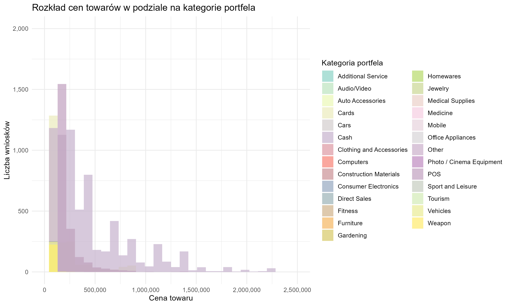
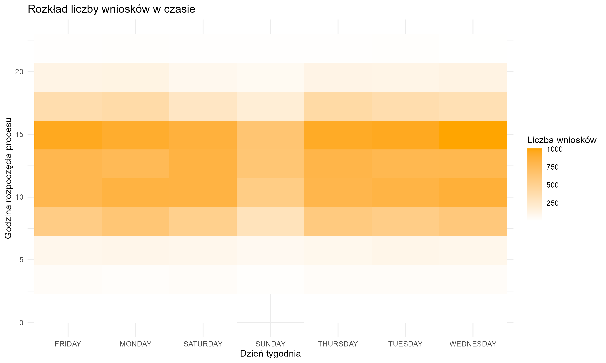
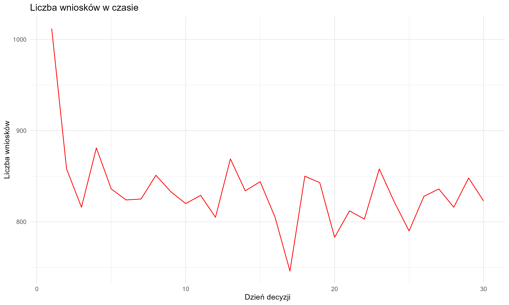
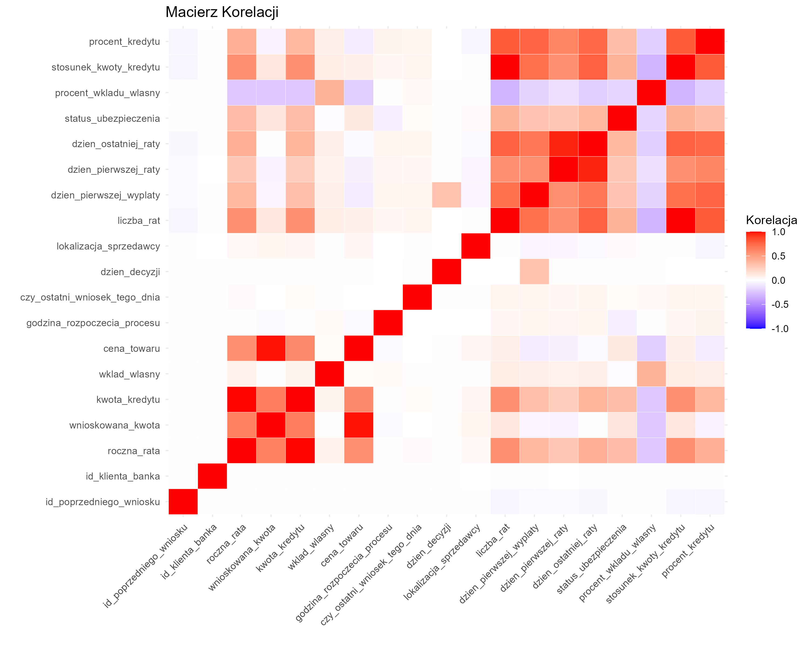

🎯 Raport Analizy Danych - Projekt Zespołowy 2024-2025
⭐ 1. Wprowadzenie

Analiza danych odgrywa fundamentalną rolę w realizacji projektów opartych na danych.

Niniejszy raport koncentruje się na obróbce historycznych danych dotyczących wniosków kredytowych. Proces ten obejmuje ich:
- oczyszczanie,
- analizę,
- wizualizację.

Dzięki odpowiedniemu przetwarzaniu danych możliwe jest nie tylko eliminowanie nieścisłości, ale również ich przekształcenie, co pozwala na:
- formułowanie wartościowych wniosków,
- podejmowanie bardziej świadomych decyzji strategicznych.

Celem projektu jest:
1. Przedstawienie kompleksowego podejścia do analizy danych.
2. Zaprezentowanie etapów od przygotowania danych aż po ich interpretację.

Szczególny nacisk położono na:
- identyfikację braków,
- weryfikację spójności,
- transformację kluczowych informacji.

Te etapy stanowią fundament dla zaawansowanych metod analitycznych, takich jak:
- wnioskowanie statystyczne,
- odkrywanie ukrytych wzorców w danych.

Ten dokument zawiera podsumowanie procesu analizy i oczyszczania danych w projekcie zespołowym.
Plik wejściowy: `previous_application_new.csv`  
⭐ 2. Data Cleansing. Wrangling

### 2.1. Analiza braków
- Zidentyfikowano brakujące dane w kilku kolumnach, uwzględniając ich liczbę i procent.
- Skupiono się na kolumnach z największą liczbą braków.

### 2.2. Usuwanie kolumn z dużą liczbą braków
- Usunięto kolumny z brakami danych przekraczającymi 90%.
- Lista usuniętych kolumn została zarchiwizowana.

### 2.3. Naprawa braków w danych
- Braki w danych liczbowych uzupełniono medianą.
- Braki w danych kategorycznych uzupełniono trybem.

### 2.4. Walidacja danych
- Wszystkie kolumny zostały zweryfikowane jako kompletne.
- Walidacja potwierdziła brak brakujących danych.

### 2.5. Zapis oczyszczonych danych
> Proces przetwarzania i czyszczenia danych był kluczowym krokiem w przygotowaniu informacji do dalszej analizy.

- **Eliminacja kolumn:** Usunięto kolumny z dużą liczbą braków, co pozwoliło na poprawę spójności danych.
- **Uzupełnienie braków:** Braki w zmiennych liczbowych uzupełniono medianą, natomiast w zmiennych kategorycznych trybem.

> Dzięki tym operacjom uzyskano zestaw danych:
- kompletny,
- zgodny ze standardami analitycznymi,
- gotowy do dalszego przetwarzania.

> **Weryfikacja danych:**
- Walidacja pozwoliła zidentyfikować i wyeliminować potencjalne rozbieżności.
- Potwierdzono integralność i spójność przekształconych danych.

> Oczyszczone dane stanowią solidną podstawę dla kolejnych etapów projektu, takich jak:
- wizualizacja danych,
- analiza opisowa,
- testy statystyczne.

> Finalny plik z przetworzonymi danymi został zapisany pod ścieżką:
`C:/Users/user/Documents/GIT projekts/Analiza_danych-Projekt_Zespolowy2024-2025/previous_application_cleaned_finished.csv`

⭐ 3. Wizualizacja Danych

W tej sekcji przedstawiono kluczowe wizualizacje danych przygotowanych na podstawie wcześniejszej analizy. Każdy wykres został zapisany i opisany poniżej.

### Rozkład Wnioskowanej Kwoty

- Większość wniosków dotyczy niewielkich kwot poniżej 500 000.
- Rozkład jest prawostronnie skośny.

### Rozkład Kwoty Kredytu

- Zdecydowana większość wniosków dotyczy niskich kwot kredytu (poniżej 500 000).
- Pojawiają się nieliczne przypadki wysokich kwot kredytu (powyżej 2 000 000).

### Rozkład Wkładu Własnego

- Największa liczba wniosków dotyczy wkładu własnego w przedziale 40 000–50 000.
- Rozkład jest symetryczny z niewielką liczbą wartości skrajnych.

### Rozkład Cen Towarów

- Dominują towary o cenie poniżej 500 000.
- Rozkład wskazuje na prawostronną skośność.

### Rozkład Rocznej Raty

- Większość wniosków dotyczy rat rocznych poniżej 50 000.
- Nieliczne przypadki wskazują na wysokie raty powyżej 150 000.

### Rozkład Wnioskowanej Kwoty w Podziale na Typ Umowy

- Kredyty gotówkowe najczęściej mieszczą się w przedziale 100 000–150 000.
- Inne typy kredytów skupiają się w niższych przedziałach kwotowych.

### Rozkład Cen Towarów w Podziale na Kategorie Portfela

- Towary o niskich cenach (poniżej 500 000) dominują niezależnie od kategorii portfela.

### Zależność Między Wnioskowaną Kwotą a Kwotą Kredytu

- Widoczna jest liniowa zależność między wnioskowaną kwotą a przyznanym kredytem.

### Zależność Między Procentem Kredytu a Wkładem Własnym

- Wysoki wkład własny częściej występuje przy niższym procencie kredytu.

### Rozkład Celów Kredytów

- Dominują kredyty przeznaczone na remonty, inwestycje i bieżące wydatki.

### Stan Umowy w Zależności od Rodzaju Klienta

- Proporcje stanów umowy różnią się w zależności od rodzaju klienta.

### Rozkład Liczby Wniosków w Czasie

- Najwięcej wniosków jest składanych w godzinach popołudniowych.

### Liczba Wniosków w Czasie (Dzień Decyzji)

- Liczba wniosków zmienia się w zależności od dnia, wskazując na różnorodne trendy.

### Kwota Kredytu w Zależności od Celu Kredytu

- Kredyty na budowę domu lub zakup nieruchomości charakteryzują się najwyższymi kwotami.

### Rozkład Liczby Rat w Podziale na Kategorię Produktu

- Liczba rat różni się w zależności od kategorii produktu. Najwięcej rat przypada na produkty hipoteczne.

Każda wizualizacja została zapisana w formacie `.png` i może być wykorzystywana do dalszej analizy i prezentacji wyników.

⭐ 4. Analiza Opisowa

W tej sekcji przedstawiono analizę danych w oparciu o różne zmienne opisowe i ilościowe.

### 4.1 Boxplot: Wnioskowana Kwota (log10)

Poniżej przedstawiono boxplot dla wnioskowanej kwoty z wykorzystaniem skali logarytmicznej.

- Wykres przedstawia rozkład wnioskowanej kwoty w skali logarytmicznej.
- Widoczna jest obecność wartości odstających w górnym zakresie kwot.

### 4.2 Macierz Korelacji

Wykres przedstawia macierz korelacji pomiędzy zmiennymi numerycznymi w zbiorze danych.

- Wykres pokazuje relacje między zmiennymi numerycznymi w danych.
- Silne korelacje mogą sugerować redundancję zmiennych lub istotne relacje.

### 4.3 Obserwacje na Podstawie Analizy Opisowej

- **Macierz Korelacji**: Wskazuje na potencjalne powiązania między zmiennymi, które mogą być istotne dla dalszych analiz.
- **Boxplot Wnioskowanej Kwoty**: Rozkład wskazuje na obecność wartości odstających w górnym zakresie, co może mieć wpływ na analizy statystyczne.

### 4.4 Wnioski i Sugestie

- Większość wniosków dotyczy umiarkowanych kwot, ale widoczne są wartości odstające w górnym zakresie.
- Silne korelacje między zmiennymi numerycznymi mogą sugerować redundancję lub istotne relacje, które należy uwzględnić w dalszych analizach.

⭐ 5. Wnioskowanie (testy statystyczne)
- Omówione zostaną wyniki testów statystycznych wspierających wnioskowanie.

⭐ 6. Podsumowanie i wnioski końcowe
- Podsumowanie głównych wyników i proponowane wnioski końcowe.
